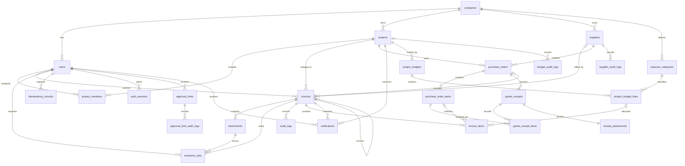

# تصميم البيانات الأولي

التاريخ: 14 سبتمبر 2026. الجداول السبعة والعشرون التالية منفذة بترحيلات Alembic على PostgreSQL، حتى `0012_in_app_notifications`. تعريف الحقول الفعلي في `04_Source_Code/backend/app/models.py`؛ تحقق `alembic check` من تطابقه مع قاعدة البيانات.

## الجداول اللازمة لأول جزء

| الجدول | دوره وأهم حقوله |
|---|---|
| companies | نطاق الشركة: id وname. |
| users | الحساب: id وcompany_id وname وemail وpassword_hash وrole وis_active وrevision وupdated_at. البريد فريد وفق سياسة الدخول المطبقة. |
| projects | المشروع: id وcompany_id وname وcode وis_active وrevision وupdated_at. الرمز فريد داخل الشركة. |
| project_members | تكليف المستخدم بمشروع: project_id وuser_id وmembership_role، مع منع تكرار التكليف. |
| administration_audit_logs | سجل إضافة فقط لإنشاء وتعديل الحسابات والمشاريع والعضويات وإعادة كلمة المرور، مع المنفذ والمستهدف والقيم غير السرية. |
| invoices | المسودة: id وcompany_id وproject_id وcreated_by وstatus وrevision وnote وcreated_at وupdated_at. |
| attachments | الملف: id وinvoice_id وstorage_key وoriginal_name وmedia_type وsize_bytes وsha256 وuploaded_by وcreated_at. |
| audit_logs | الحدث: id وcompany_id وinvoice_id وactor_id وaction وcreated_at وdetails، مع سياسة إضافة فقط لحساب التطبيق. |
| idempotency_records | منع تكرار أثر الطلب: id وuser_id وoperation وkey وrequest_hash وinvoice_id وcreated_at. لا يوجد انتهاء تلقائي في هذا الإصدار. |
| auth_sessions | جلسة قابلة للإبطال: id وuser_id وcsrf_token وexpires_at وrevoked_at. |
| suppliers | دليل الشركة ونتيجة التحقق الداخلي: الاسم والرقم الضريبي والمنطقة السعودية والحالة والملاحظة والمراجع والوقت والمنشئ. يمنع name_key تكرار الاسم الموحد داخل الشركة. |
| invoice_items | بنود المسودة بترتيب position: الوصف والوحدة والكمية وسعر الوحدة والخصم والنسبة، وقيمة البند والصافي والضريبة والإجمالي، وربط اختياري ببند أمر الشراء وبند ميزانية المشروع. القيم NUMERIC وترتيب البند فريد داخل الفاتورة. |
| extraction_jobs | اقتراحات مستقلة: invoice_id وrequested_by وattachment_id وsource_sha256 وbase_revision وlanguage وstatus وattempts وattempt_id وlease_until وresult JSONB وerror_code والتوقيتات. يحمل result اقتراحات OCR/PDF/QR/XML والمصادر المنظمة، ومنذ 0.17.0 النص والمقاطع بترتيبها وثقتها وصناديقها وطريقة قراءة كل صفحة؛ فهرس فريد جزئي يمنع أكثر من مهمة QUEUED/RUNNING للفاتورة. |
| purchase_orders | أمر الشراء المرجعي: الشركة والمشروع والمورد والرقم الموحّد والتاريخ والعملة والمنشئ. |
| purchase_order_items | بنود الأمر بالترتيب والوصف والوحدة والكمية المطلوبة وسعر الوحدة والضريبة. |
| goods_receipts | محضر الاستلام: الأمر والرقم الموحّد والتاريخ والملاحظة والمنشئ. |
| goods_receipt_items | الكمية المستلمة لكل بند أمر، مع منع تكرار البند داخل المحضر. |
| receipt_attachments | ملف إثبات خاص واحد لكل محضر مع الاسم والنوع والحجم والبصمة ومسار التخزين. |
| procurement_audit_logs | سجل إضافة فقط لإنشاء الأمر ومحضر الاستلام وتفاصيلهما المرجعية. |
| approval_limits | حد المبلغ لكل مدير مشروع أو مالية وعملة، مع آخر منفذ وتوقيت. يمنع تكرار المستخدم والعملة. |
| approval_limit_audit_logs | سجل إضافة فقط للقيمة قبل وبعد وهوية المستهدف والمنفذ. |
| supplier_audit_logs | سجل إضافة فقط لتغير حالة التحقق الداخلي من المورد ودليل القرار. |
| notifications | تنبيه خاص بالمستلم مرتبط بالفاتورة والمشروع: النوع والعنوان والرسالة ومفتاح منع التكرار ووقت الإنشاء والقراءة. |
| expense_categories | رمز فئة المصروف واسمها وحالتها داخل الشركة، مع منشئها ووقتها ورمز فريد للشركة. |
| project_budgets | إجمالي ميزانية مشروع وعملة ورقم نسختها وآخر منفذ؛ مشروع واحد له ميزانية واحدة لكل عملة. |
| project_budget_lines | بنود الميزانية الحالية والمؤرشفة: الفئة والترتيب والوصف والوحدة والكمية والسعر والمخصص. |
| budget_audit_logs | سجل إضافة فقط لإنشاء الفئات والميزانيات وتعديلها مع القيم قبل وبعد. |

تُستخدم UUID للمعرّفات وأوقات UTC من الخادم. تفحص المعاملات اتساق شركة المستخدم والمشروع والفاتورة. بصمة الملف وسيلة مقارنة وليست توقيع أصالة.

حساب التطبيق `invoice_app` منفصل عن حساب الترحيلات المالك. لا يملك تعديل أو حذف أو تفريغ سجلات الفواتير والشراء وحدود الموافقات والتحقق من المورد والميزانية؛ توجد أيضًا triggers تمنع تحديث صفوفها أو حذفها. هذه حماية داخل قاعدة التطبيق وليست سجلًا خارجيًا مستقلًا عن مدير قاعدة البيانات.

لم يحتج الإصدار `0.6.0` ترحيلًا جديدًا؛ حفظ QR/XML يستخدم حقل `result` الموجود ويربط النتيجة بمعرف المرفق وبصمة الأصل. يقبل جدول المرفقات `application/xml` بعد تحقق الخادم، ويبقى الملف خارج المجلد العام.

## إضافة الجزء الثاني

تضاف إلى invoices حقول supplier_id وsupplier_snapshot وinvoice_number وinvoice_date وcurrency، وإجماليات subtotal وdiscount_total وtax_total وgrand_total من النوع NUMERIC(22,2). تبقى خالية للفواتير المرفوعة قبل إدخال البنود. تحفظ نسخة بيانات المورد مع الفاتورة، ويحتوي حدث DRAFT_UPDATED على رقم النسخة والقيم الكاملة قبل وبعد التعديل، بما فيها البنود. لا يلزم حذف أصل الملف أو استبداله لتعديل الحقول.

الكمية NUMERIC(14,4) وسعر الوحدة NUMERIC(18,4) ونسبة الضريبة NUMERIC(7,4). الحساب باستخدام Decimal وسياسة موثقة في مواصفات الجزء الثاني. اتصال التطبيق يضبط جلسة PostgreSQL على UTC ليكون تمثيل الأوقات متسقًا بعد الحفظ وإعادة القراءة.

## إضافة الجزء الثالث

ترحيل 0004_invoice_workflow يضيف إلى invoices حقول submitted_revision وsubmitted_at وproject_approved_by (مفتاح إلى users) وproject_approved_revision. الحقول nullable للمسودات القديمة، ولم تتغير بياناتها المالية أو ملفاتها.

قيد الحالة يسمح بست حالات. يلزم لكل حالة مرسلة رقم إرسال موجب لا يتجاوز revision مع تاريخ إرسال. تتطلب FINANCE_REVIEW وAPPROVED هوية موافق المشروع ورقمًا مطابقًا لنسخة الإرسال. الحالات الأخرى لا تحمل موافقة مشروع فعالة. رقم revision يتغير مع تعديل البيانات ومع انتقال الحالة.

قرارات الموافقة والرفض وطلبات التعديل محفوظة كأحداث كاملة في audit_logs القائم، مع snapshot للبيانات وقت الإجراء. لا توجد جداول موافقات أو توضيحات منفصلة في هذا التسليم؛ يمكن إضافتها عند الحاجة للتفويض أو الإسناد أو التصعيد مع الحفاظ على السجل الحالي. يرفض downgrade الرجوع للنسخة السابقة إذا وجدت أي فاتورة غير DRAFT، حتى لا يمحو تاريخ المراجعة أو يعيد خصوصيتها بصمت.

## إضافة التدقيق المالي الأولي

يضيف `0006_financial_audit` إلى invoices الحقول الاختيارية `document_subtotal` و`document_tax_total` و`document_grand_total` من النوع NUMERIC(22,2)، مع منع القيم السالبة. تمثل هذه الحقول ما راجعه الموظف على أصل الفاتورة، وتبقى مستقلة عن الإجماليات المحسوبة من البنود.

نتائج الفحوص الحالية تحسب عند قراءة الفاتورة من البيانات والمرفق الحاليين، ولا تحتاج جدول نتائج مستقلًا. يحفظ كل حدث قرار نسخة `audit_snapshot` داخل details مع البيانات المالية وقت الإجراء. كشف تطابق الملف يعتمد على attachments.sha256، وكشف الهوية المالية يقارن فواتير الشركة دون إعادة تفاصيل الفواتير المطابقة للمستخدم.

## إضافة أوامر الشراء والاستلام

يضيف `0007_purchase_orders_receipts` جداول الأمر والبنود ومحاضر الاستلام وبنودها وإثباتاتها وسجلها. يضيف `purchase_order_id` إلى invoices و`purchase_order_item_id` إلى invoice_items كمفاتيح اختيارية، ولذلك تبقى الفواتير القديمة صالحة وغير مرتبطة.

الكميات المطلوبة والمستلمة `NUMERIC(14,4)` والأسعار `NUMERIC(18,4)` والضريبة `NUMERIC(7,4)`. تمنع القيود القيم غير الموجبة للكميات والقيم السالبة للأسعار والضريبة خارج 0–100. يمنع الرجوع من الترحيل إذا وجدت بيانات شراء حتى لا تضيع بصمت.

## إضافة الحوكمة والإشعارات

يضيف `0008_governance_documents` جداول حدود الموافقات وسجل تغييراتها وسجل تحقق المورد. يضيف إلى suppliers الحالة والملاحظة والمراجع والتوقيت، وإلى invoices نوع المستند ورابطًا ذاتيًا اختياريًا للأصل. يفرض قيد قاعدة البيانات أن الفاتورة الأصلية بلا رابط وأن الإشعار الدائن أو المدين يحمل رابطًا.

الحد `NUMERIC(22,2)` غير سالب، وفريد للمستخدم والعملة. سجلا الحدود والمورد محميان كإضافة فقط. يمنع الرجوع من الترحيل عند وجود إشعارات أو سجل حوكمة حتى لا يمحو تاريخًا ماليًا بصمت.

## إضافة فئات المصروفات والميزانيات

يضيف `0009_project_budgets` جداول `expense_categories` و`project_budgets` و`project_budget_lines` و`budget_audit_logs`، ويضيف `project_budget_line_id` الاختياري إلى `invoice_items`. الميزانية فريدة للمشروع والعملة، وتحمل رقم نسخة موجبًا. المخصصات والإجمالي `NUMERIC(22,2)`، والكمية `NUMERIC(14,4)` وسعر الوحدة `NUMERIC(18,4)`.

يبقى بند الميزانية عند إزالته مؤرشفًا بدل حذفه كي لا ينكسر ربط الفواتير السابقة. يحسب الاستخدام من الفواتير وبنودها الحالية حسب الحالة دون جدول أرصدة مكرر، ويسجل تكوين الميزانية قبل وبعد داخل سجل محمي كإضافة فقط. يمنع الرجوع من الترحيل عند وجود ميزانية أو تاريخها.

## إضافة إدارة المشاريع والمستخدمين

يضيف `0010_project_user_administration` رقمي نسخة وتوقيت تعديل إلى `users` و`projects`، ويفرض تفرد رمز المشروع داخل الشركة. يضيف `administration_audit_logs` لعمليات الإنشاء والتعديل والعضويات وإعادة كلمات المرور، ويحميه بمحفز `reject_audit_change()` وسحب صلاحيات التعديل والحذف والاقتطاع من حساب التطبيق.

لا يخزن سجل الإدارة كلمة المرور المؤقتة أو تجزئتها. إلغاء الجلسات عند إعادة كلمة المرور يحدث في `auth_sessions`. العضوية تبقى في `project_members`، ودورها مشتق من دور الحساب عند الكتابة من API الإدارة.

## إضافة منطقة المورد

يضيف `0011_supplier_regions` الحقل الاختياري `region_code` إلى `suppliers` مع قيد للمناطق السعودية الثلاث عشرة وفهرس للبحث. تنسخ المنطقة إلى `supplier_snapshot` عند حفظ الفاتورة حتى تعتمد المقارنة على سياق السجل وقت الحفظ.

يضيف `0012_in_app_notifications` جدول `notifications`. القيد الفريد على المستلم ومفتاح الحدث يمنع النسخ المتكررة، والفهارس تدعم صندوق الوارد والعداد. يتغير `read_at` عند القراءة، بينما تبقى قرارات الفاتورة في `audit_logs` المحمي كإضافة فقط.

## ما يضاف بالتدريج

- ربط التحقق الرسمي من المورد بمصدر مخول عند توفره.
- الاستخراج والفحوص: document_jobs وextraction_versions وrisk_findings، مع حفظ المصدر والثقة وإصدار المعالجة.
- توسيع المراجعة: إسناد المراجعين والتفويض والتصعيد وحدود المشروع والفئة والمخاطر.
- الرقابة المنفذة دون جدول جديد: يحسب كشف التجزئة ودرجة المخاطر من الجداول الحالية، ويحفظهما داخل `audit_snapshot` في سجل القرار، وتجمع اللوحة أثر الإشعارات حسب الحالة والعملة.
- التحليل: تاريخ أسعار مادي عند الحاجة، والتقارير القابلة للتصدير.

المبالغ عند إضافتها تحفظ في NUMERIC وتُحسب باستخدام Decimal، مع تحديد دقة الأسعار والكميات والتقريب. تبقى القيمة المفقودة غير معلومة حتى تتوفر؛ لا تُحوّل إلى صفر تلقائيًا.

## الحالات

الحالات المنفذة: DRAFT ثم PROJECT_REVIEW ثم FINANCE_REVIEW ثم APPROVED، مع CHANGES_REQUESTED وREJECTED. طلب التعديل يعيد الفاتورة للموظف وإعادة الإرسال تبدأ من PROJECT_REVIEW. [مواصفات الانتقالات](../../02_Requirements/Use_Cases/INVOICE_WORKFLOW_AR.md).

حالة مهمة الاستخراج التقنية ستتبع منفصلة عن الموافقة المالية. لا تساوي الموافقة حصول دفع فعلي، ولا يضيف هذا التسليم حالة جاهزية للدفع بناء على ضوابط لم تنفذ بعد.
