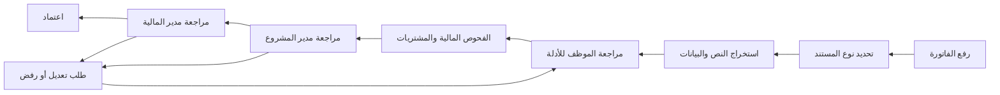
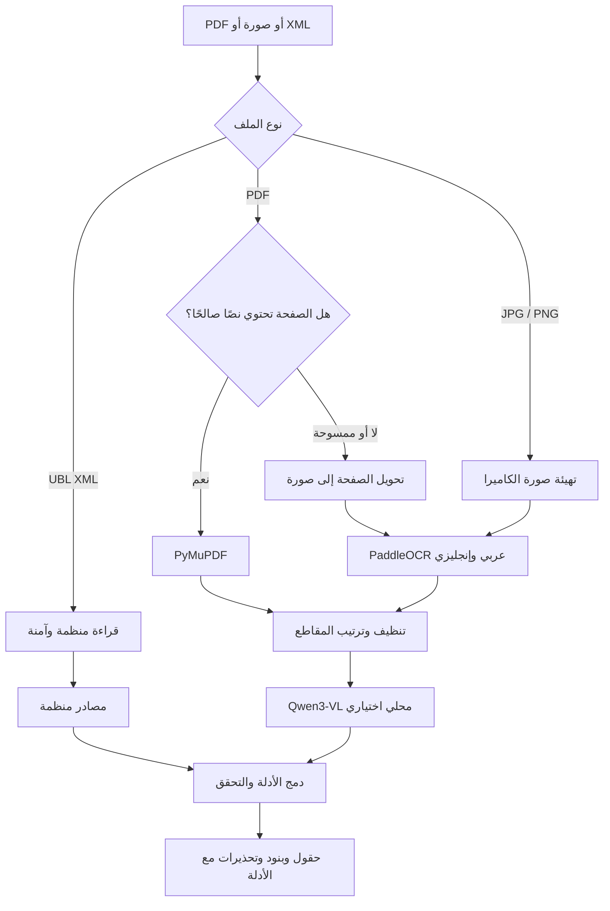
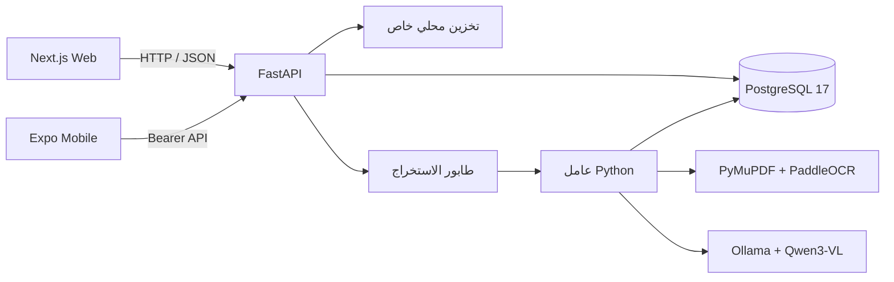

# واصل | Wasil

### منصة محلية لتدقيق الفواتير ومراقبة مصاريف المشاريع بالذكاء الاصطناعي


**واصل** مشروع تخرج لنظام يساعد فرق المشاريع والمالية على تحويل الفاتورة من مستند غير منظم إلى بيانات قابلة للمراجعة، ثم فحص الحسابات والمشتريات والأسعار والمخاطر وتمريرها عبر دورة موافقات واضحة ومسجلة.

هذه نسخة **Local-first** تعمل على جهاز Windows بقاعدة PostgreSQL محلية ومعالجة مستندات محلية. لا تعتمد الوظائف الأساسية على API خارجي، ولا يحتوي المستودع على فواتير حقيقية أو كلمات مرور أو قواعد بيانات تشغيلية.

[الدليل العربي الموسع](README_AR.md) · [طريقة التشغيل](RUN_LOCAL_AR.md) · [عقد API](03_Design/API_Contracts/API_V1_AR.md) · [تصميم البيانات](03_Design/Database_ERD/DATA_MODEL_V1_AR.md)

---

## لماذا واصل؟

مراجعة فواتير المشاريع يدويًا تعرض الفريق لأخطاء الإدخال، وتكرار الفاتورة، واختلاف السعر، ونقص إثبات الاستلام، وتجاوز الميزانية. يجمع واصل المستند وبيانات المشروع وأوامر الشراء وسجل الأسعار في مسار واحد، ويعرض أسباب التنبيه وأدلته للمراجع بدل اتخاذ قرار مالي تلقائي.

### ما الذي ينجزه النظام؟

- رفع PDF وJPG وJPEG وPNG وUBL XML مع قيود للحجم والنوع وعدد الصفحات.
- استخراج النص العربي والإنجليزي والمختلط مع رقم الصفحة وترتيب القراءة والصندوق ودرجة المحرك.
- قراءة PDF النصي مباشرة عبر **PyMuPDF**، واستخدام **PaddleOCR** للصفحات الممسوحة والصور.
- فهم الحقول والجداول محليًا عبر **Qwen3-VL** مع ربط كل اقتراح بدليل مرئي أو نصي.
- قراءة QR المتوافق مع ZATCA وUBL XML ومقارنة المصادر المنظمة بالنص الظاهر.
- مراجعة المورد ورقم الفاتورة والتاريخ والعملة والإجماليات والضريبة والبنود قبل الحفظ.
- إعادة حساب الإجماليات باستخدام `Decimal` وفحص الضريبة والخصومات وفروق التقريب.
- كشف التكرار التام والتقريبي، وارتفاع السعر، وتجزئة الفواتير حول حدود الموافقة.
- مطابقة الفاتورة مع أمر الشراء وإثبات الاستلام ضمن المطابقة الثلاثية.
- مقارنة أسعار الموردين بحسب المنطقة عند توافر عينة قابلة للمقارنة.
- إدارة ميزانيات المشاريع وفئات المصروفات وحساب المعتمد والملتزم وقيد المراجعة والمتبقي.
- دورة مراجعة لمدير المشروع ثم مدير المالية مع طلب تعديل أو رفض موثق.
- تنبيهات داخل النظام، لوحة مخاطر، وتقارير CSV للفواتير والميزانيات والأسعار الإقليمية.
- إدارة المستخدمين والمشاريع والعضويات وحدود الموافقة والتحقق الداخلي من الموردين.

## رحلة الفاتورة



الحالات الأساسية هي `DRAFT` ثم `PROJECT_REVIEW` ثم `FINANCE_REVIEW` ثم `APPROVED`. تظل `REJECTED` حالة نهائية، بينما تعيد `CHANGES_REQUESTED` الفاتورة إلى صاحبها للتصحيح. تأكيد الموظف للاستخراج لا يمثل موافقة مالية.

## مسار فهم المستند



يحافظ الناتج على النص، الصفحة، ترتيب القراءة، إحداثيات الأدلة، مصدر القيمة، درجة المحرك، والقراءات المتعارضة. لا تُنقل الاقتراحات إلى بيانات الفاتورة إلا بعد مراجعة المستخدم وحفظه الصريح.

## المعمارية المحلية



- **Next.js** مسؤول عن تجربة الاستخدام العربية وواجهات المراجعة والإدارة.
- **FastAPI** هو مصدر الصلاحيات وقواعد العمل والحسابات وانتقالات الحالات.
- **PostgreSQL** يحفظ البيانات والطابور والجلسات وسجلات التدقيق.
- **عامل الاستخراج** يعالج المستند خارج طلب الويب ويعيد نتيجة قابلة للتتبع.
- **التخزين المحلي** يحتفظ بالمرفقات داخل `.local/uploads` خارج مجلد الويب العام.

## التقنيات

| الطبقة | التقنيات المستخدمة |
|---|---|
| الويب | Next.js 16.3.4، React 19.3، TypeScript 7، Tailwind CSS 4، Radix UI، Lucide |
| الخادم | Python 3.13، FastAPI 0.141.1، Pydantic 2.13.5، Uvicorn 0.52.4 |
| البيانات | PostgreSQL 17، SQLAlchemy 2.0.52، Alembic 1.19.2، psycopg 3.3.5 |
| قراءة المستند | PyMuPDF 1.28.2، PaddleOCR 3.7.0، PaddlePaddle 3.3.1، OpenCV 4.10، pypdf 6.18، pypdfium2 5.13 |
| الفهم البصري | Ollama مع `qwen3-vl:8b-instruct`، نموذج Q4_K_M يعمل محليًا |
| الجوال | Expo 57، React Native 0.86، TypeScript، SecureStore، Document Picker |
| الجودة | Pytest 9، Playwright 1.63، Ruff، Prettier، TypeScript compiler |

الإصدارات الدقيقة مثبتة في ملفات `requirements.lock.txt` و`package-lock.json` لضمان قابلية إعادة البيئة.

## الصلاحيات

| الدور | المسؤوليات الأساسية |
|---|---|
| الموظف | رفع الفاتورة، مراجعة الاستخراج، تعديل المسودة وإرسالها |
| مدير المشروع | مراجعة ارتباط المصروف بالمشروع والميزانية والاستلام والأسعار |
| مدير المالية | المراجعة المالية، الاعتماد النهائي، إدارة الموردين والحدود والتقارير |

تطبق الصلاحيات في الخادم. المسودة خاصة بصاحبها، ومدير المشروع يرى فقط المشاريع التي يديرها، ومدير المالية يعمل ضمن الشركة نفسها.

## هيكلة المستودع

```text
Graduation-Project/
├── 01_Proposal/                  # تعليمات حفظ البروبزل بعيدًا عن البيانات الحساسة
├── 02_Requirements/              # حالات الاستخدام والأدوار وقواعد العمل
├── 03_Design/                    # المعمارية وعقد API وتصميم قاعدة البيانات
├── 04_Source_Code/
│   ├── web/                      # Next.js وواجهة المستخدم
│   ├── backend/                  # FastAPI والخدمات والاختبارات
│   ├── database/migrations/      # ترحيلات Alembic
│   ├── ai/document_intelligence/ # OCR وPDF وQR وXML والفهم المحلي
│   ├── ai/financial_intelligence/# توثيق الذكاء المالي
│   └── mobile/                   # تطبيق Expo الأولي
├── 05_Data/                      # سياسة العينات؛ البيانات الفعلية مستبعدة من Git
├── 06_Testing_Evaluation/        # تقارير القياس ونتائج الاختبارات
├── 07_Documentation/             # مكان التقرير ودليل المستخدم
├── 08_Presentation_Demo/         # مكان العرض ومواد التجربة الآمنة
├── 09_Project_Management/        # الخطة الفردية وحالة التنفيذ
├── 10_Deployment/Scripts/        # إعداد وتشغيل محلي على Windows
├── README.md
├── README_AR.md
└── RUN_LOCAL_AR.md
```

هذه الهيكلة تمثل النسخة المحلية للمشروع قبل إضافة أي بنية نشر سحابية. مجلدات البيانات الخاصة والأرشيف وملفات البروبزل الأصلية لا تُرفع إلى المستودع العام.

## التشغيل السريع على Windows

### المتطلبات

- Windows 10 أو 11 بنظام 64-bit.
- Python 3.13 مع Python Launcher.
- Node.js 24 LTS.
- اتصال إنترنت أثناء الإعداد الأول.
- Ollama اختياري لتشغيل Qwen3-VL؛ يبقى الاستخراج النصي متاحًا عند غيابه.

### 1. تنزيل المشروع

```powershell
git clone https://github.com/Faisalz78/Graduation-Project.git
Set-Location '.\Graduation-Project'
```

### 2. إعداد التطبيق وقاعدة البيانات

```powershell
.\Setup_Project.cmd
```

ينشئ الإعداد أسرارًا عشوائية وقاعدتي تطوير واختبار داخل `.local`، ويثبت PostgreSQL المحمول واعتماديات الخادم والويب. لا تُحفظ الأسرار في Git.

### 3. إعداد قارئ المستندات الكامل

```powershell
py -3.13 -m venv .local\ocr-venv
& .\.local\ocr-venv\Scripts\python.exe -m pip install -r .\04_Source_Code\ai\document_intelligence\requirements.lock.txt
& .\.local\ocr-venv\Scripts\python.exe .\04_Source_Code\ai\document_intelligence\run_extraction.py --prepare-models
```

لإضافة الفهم البصري المحلي، ثبّت Ollama ثم نفّذ:

```powershell
powershell.exe -NoProfile -ExecutionPolicy Bypass -File .\10_Deployment\Scripts\ensure-local-vision.ps1 -DownloadModel
```

حجم نموذج Qwen المحلي يقارب 6.1GB. وجود بطاقة رسومية مناسبة يحسن السرعة، ويمكن متابعة استخدام النظام دون طبقة Qwen عند عدم توافرها.

### 4. التشغيل

```powershell
.\Start_Project.cmd
```

ثم افتح `http://127.0.0.1:3000`. ينشئ الإعداد حسابات تجريبية محلية ويضع بياناتها في `.local/DEMO_ACCOUNTS.md`.

لإيقاف الخدمات:

```powershell
.\Stop_Project.cmd
```

راجع [دليل التشغيل المفصل](RUN_LOCAL_AR.md) للتشخيص والاختبارات وإعداد الجوال.

## الأمان والخصوصية

- الأسرار وقاعدة PostgreSQL والمرفقات والنماذج وبيانات الحسابات تحفظ داخل `.local` المستبعد من Git.
- يستخدم التطبيق دورًا للترحيلات ودورًا أقل صلاحية للتشغيل.
- سجلات التدقيق الأساسية تمنع التعديل والحذف من دور التطبيق.
- جلسة الويب داخل Cookie من نوع HttpOnly مع تحقق Origin وCSRF، بينما يستخدم الجوال Bearer Token داخل SecureStore.
- يمنع الخادم عبور المسارات ويتحقق من امتداد الملف وتوقيعه وحجمه وعدد الصفحات وحدود المعالجة.
- يعيد الذكاء الاصطناعي اقتراحات تحتاج مراجعة بشرية؛ لا يعتمد فاتورة ولا ينفذ عملية دفع.
- لا يتضمن المستودع العام فواتير حقيقية أو ملف `.env` أو كلمات مرور أو مفاتيح خاصة.

للتعامل مع ثغرة أو ملف حساس راجع [سياسة الأمان](SECURITY.md)، ولا ترفق مستندًا حقيقيًا في Issue عامة.

## الاختبارات والتحقق

| المجال | آخر تحقق موثق في النسخة المحلية |
|---|---|
| الخادم وقواعد العمل | 196 اختبار Pytest على قاعدة `invoice_audit_test` المعزولة |
| وحدة استخراج المستند | 70 اختبارًا للاستخراج والقراءة الموجهة والأدلة والجداول |
| الويب | بناء Next.js وTypeScript وPrettier ناجح؛ 27 سيناريو متصفح في الإصدار السابق واختباران موجهان للإصدار 0.19 |
| الاستخراج | مجموعات اصطناعية عربية وإنجليزية وصور ضغط وميل وPDF نصي وممسوح |

تقارير النتائج موجودة داخل [`06_Testing_Evaluation/Results`](06_Testing_Evaluation/Results). الأرقام تصف عينات التطوير الموثقة ولا تمثل ضمان دقة لكل فاتورة واقعية.

## حدود المشروع

- النظام أداة دعم قرار، ولا يحول الأموال ولا يستبدل ERP أو مراجعة المختص.
- لا يثبت أصالة الفاتورة ولا يتحقق تشفيريًا من توقيع ZATCA في النسخة الحالية.
- جودة الصور الرديئة جدًا والانعكاسات والطيات والجداول غير المألوفة قد تحتاج تصحيحًا يدويًا.
- المقارنة السعرية تعتمد على جودة السجل التاريخي وتشابه المنتج والوحدة والفترة والمنطقة.
- تطبيق الجوال الموجود تسليم أولي للدخول والرفع والمتابعة، وتطويره الموسع مجمد مؤقتًا.
- النشر الخارجي والنسخ الاحتياطي التشغيلي والتقييم المستقل على مجموعة واقعية متنوعة خارج نطاق هذه النسخة المحلية.

## وثائق مهمة

- [خطة التقنيات والبناء](03_Design/Architecture/TECHNOLOGY_PLAN_AR.md)
- [مصفوفة الصلاحيات](02_Requirements/User_Roles/PERMISSIONS_AR.md)
- [الاستخراج الهجين](02_Requirements/Use_Cases/HYBRID_TEXT_EXTRACTION_AR.md)
- [الفهم البصري المحلي](02_Requirements/Use_Cases/LOCAL_INVOICE_UNDERSTANDING_AR.md)
- [سير مراجعة الفاتورة](02_Requirements/Use_Cases/INVOICE_WORKFLOW_AR.md)
- [الذكاء المالي والتكرار](02_Requirements/Use_Cases/PRICE_AND_DUPLICATE_INTELLIGENCE_AR.md)
- [المطابقة الثلاثية](02_Requirements/Use_Cases/PURCHASE_ORDER_RECEIPT_MATCHING_AR.md)
- [خطة المطور الفردي](09_Project_Management/Weekly_Plans/SOLO_BUILD_PLAN_AR.md)

---

## English overview

Wasil is a local-first graduation project for AI-assisted invoice auditing and project expense control. It combines a Next.js Arabic interface, a FastAPI domain API, PostgreSQL workflow and audit storage, PyMuPDF/PaddleOCR document reading, and optional local Qwen3-VL visual understanding. The system extracts reviewable evidence, validates totals, compares purchasing records and historical prices, and routes invoices through project and finance approval. Human review remains mandatory, and no payment is executed by the application.
